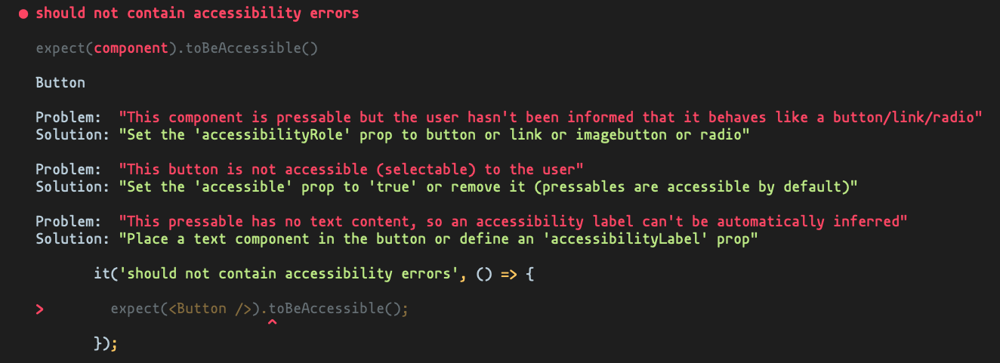

<div align="center">
  
</div>

<h1 align="center">
React Native Accessibility Engine
</h1>

<h3 align="center">
Make accessibility-related assertions in React Native
</h3>

<div align="center">
  <a href="https://www.npmjs.com/package/react-native-accessibility-engine">
    
  </a>
  <a href="./LICENSE">
    
  </a>
  
  
  
  <a href="https://codecov.io/gh/aryella-lacerda/react-native-accessibility-engine">
    
  </a>
  <a href="https://github.com/aryella-lacerda/react-native-accessibility-engine/actions/workflows/release.yml">
    
  </a>
</div>

## Table of Contents

- [Intro](#intro)
  - [Goals](#goals)
- [How to use](#how-to-use)
  - [Installation](#installation)
    - [React >= 18](#react--18)
    - [React < 18](#react--18-1)
  - [Configuration](#configuration)
    - [Javascript](#javascript)
    - [Typescript](#typescript)
  - [General Usage](#general-usage)
    - [With React elements](#with-react-elements)
    - [With React test instances](#with-react-test-instances)
  - [Usage with custom rules or violation handlers](#usage-with-custom-rules-or-violation-handlers)
    - [Custom default behaviors](#custom-default-behaviors)
    - [Per matcher overrides](#per-matcher-overrides)
- [Migration guides](#migration-guides)
  - [From 0.x to 1.x](#from-0x-to-1x)
  - [From 1.x to 2.x](#from-1x-to-2x)
  - [From 2.x to 3.x](#from-2x-to-3x)
- [Current rules](#current-rules)
- [Contributing](#contributing)
  - [What's a rule anyway?](#whats-a-rule-anyway)
    - [ID](#id)
    - [Matcher](#matcher)
    - [Assertion](#assertion)
    - [Help](#help)
  - [Proposing a new rule](#proposing-a-new-rule)
  - [ReactTestInstance](#reacttestinstance)
- [Related projects](#related-projects)
- [License](#license)

# Intro

The React Native ecosystem is _massive_ but it's still lagging behind React Web when it comes to accessibility tools. As mobile developers, we're still braving the challenge of mapping robust, time-tested web guidelines into equally robust guidelines for mobile. In React Native, we also face the challenge of adhering to the accessibility guidelines of multiple platforms using only [React Native's Accessibility API](https://reactnative.dev/docs/accessibility). There aren't many practical tutorials on the best use of this API, which means there are limited resources for React Native developers who want to make their apps more accessible. Indeed, there's still a lot of confusion about what makes an app accessible or what accessibility even _is_.

This project aims to make solving these problems a little easier.

### Goals

- [x] Create an engine capable of traversing a component tree making accessibility-related checks
- [ ] Create an app to showcase accessiblity best-practices
- [x] Keep it open-source!

# How to use

## Installation

React 18 introduced a breaking change related to React Test Renderer, which this engine uses. To accommodate all users, React Test Renderer is now a peer dependency. You should install the version compatible with your version of React.

### React >= 18

```sh
npm install react-native-accessibility-engine react-test-renderer --save-dev
# or
yarn add react-native-accessibility-engine react-test-renderer --dev
```

### React < 18

```sh
npm install react-native-accessibility-engine react-test-renderer@^17.0.2 --save-dev
# or
yarn add react-native-accessibility-engine react-test-renderer@^17.0.2 --dev
```

## Configuration

### Javascript

Extend Jest's `expect` with a new `toBeAccessible()` matcher by adding this to your Jest config's `setupFilesAfterEnv` array:

```sh
{
  ...
  "setupFilesAfterEnv": [..., "react-native-accessibility-engine"],
}
```

### Typescript

Adding the lib directly to Jest's `setupFilesAfterEnv` array extends Jest's matcher but doesn't import the new matcher types.

You need to import `react-native-accessibilit-engine` at least once in your codebase for the types to be imported. You can do that in an entry file if you'd like. If you have a Jest setup file, however, you could kill two birds with one stone by importing it there:

```sh
{
  ...
  "setupFilesAfterEnv": ["path/to/your/setup/file"],
}
```

```typescript
// At the top of your setup file
import 'react-native-accessibility-engine';
```

## General Usage

### With React elements

```tsx
import React from 'react';
import { Image, TouchableOpacity } from 'react-native';
import Icons from './assets';

const Button = () => (
  <TouchableOpacity accessible={false}>
    <Image source={Icons.filledHeart['32px']} />
  </TouchableOpacity>
);

it('should be accessible', () => {
  expect(<Button />)).toBeAccessible();
});
```

### With React test instances

You can also pass test instances from `react-test-renderer` and
`@testing-library/react-native`:

```tsx
import React from 'react';
import { Image, TouchableOpacity } from 'react-native';

import TestRenderer, { ReactTestInstance } from 'react-test-renderer';
import { render } from '@testing-library/react-native';

import Icons from './assets';

const Button = () => (
  <TouchableOpacity accessible={false} accessibilityRole={'button'}>
    <Image source={Icons.filledHeart['32px']} />
  </TouchableOpacity>
);

it('should be accessible, using react-test-renderer', () => {
  const button = TestRenderer.create(<Button />).root;
  expect(button).toBeAccessible();
});

it('should be accessible, using @testing-library/react-native', () => {
  const { getByA11yRole } = render(<Test />);
  const button = getByA11yRole('button');
  expect(button).toBeAccessible();
});
```

## Usage with custom rules or violation handlers

| Option                 | Description                                                                                                         | Default   |
| ---------------------- | ------------------------------------------------------------------------------------------------------------------- | --------- |
| rules                  | Pass an array of rule ids you wish to _enable_ for your jest test. See rule ids in Current Rules section of Readme. | all rules |
| customViolationHandler | Overrides the return of the jest matcher to have a custom handling with the violation array.                        | n/a       |

### Custom default behaviors

These changes will apply for every usage of the `.toBeAccessible` matcher. This would be useful for repetitive configurations. Individual overrides can still be used (as shown in the section below) to change individual behavior from the custom default behavior.

`customViolationHandler` and `rules` can be customized in `jest.setup.ts|js`:

```tsx
global.__CUSTOM_VIOLATION_HANDLER__ = (violations) => {
  console.log('violations', violations);

  return violations;
};

global.__A11Y_RULES__ = [`no-empty-text`];
```

`rules` can also be declared in`jest.config.ts|js`, or `package.json` using jest `globals` config variables with the same key names (See [globals](https://jestjs.io/docs/configuration#globals-object)).

### Per matcher overrides

We can run `.toBeAccessible` and pass one or more of these options to customize the behavior of the jest matcher for the individual execution of that matcher.

Available options:

```tsx
export type Options = {
  // Pass in the subset of rules you want to run
  rules?: RuleId[];
  // Utilize for custom handling of jest test matcher output
  customViolationHandler?: (violations: Violation[]) => Violation[];
};
```

Example usage:

```tsx
it('should be accessible, only run against no-empty-text rule', () => {
  expect(button).toBeAccessible({ rules: ['no-empty-text'] });
});

it('should be accessible, and handle violations uniquely', () => {
  const customViolationHandler = (violations) => {
    console.error(violations);
    return [];
  };
  expect(button).toBeAccessible({ customViolationHandler });
});
```

# Migration guides

## From 0.x to 1.x

- Though the `check` function's optional second argument was never officially documented, a breaking change has occurred to it. If you are using it, I'm afraid we are deprecating the `check` function in favor of the `.toBeAccessible()` matcher, which does not currently recieve any arguments. This is intentional.

```typescript
{
  // 0.x
  it('should contain no accessibility errors', () => {
    expect(() => Engine.check(<Component />, [...rules])).not.toThrow();
  });

  // 1.x
  it('should contain no accessibility errors', () => {
    expect(<Component />).toBeAccessible();
  });
}
```

## From 1.x to 2.x

- Change the path from which you import the new matcher:

```typescript
{
  // 1.x
  "setupFilesAfterEnv": [..., "react-native-accessibility-engine/lib/commonjs/extend-expect"],
  // 2.x
  "setupFilesAfterEnv": [..., "react-native-accessibility-engine"],
}
```

- The `check` function, which was deprecated in 1.x, has been removed from 2.x. It is still used internally, but the `.toBeAccessible()` matcher is the only thing exposed in 2.x.

```typescript
{
  // 0.x and possibly 1.x
  it('should contain no accessibility errors', () => {
    expect(() => Engine.check(<Component />)).not.toThrow();
  });

  // 2.x
  it('should contain no accessibility errors', () => {
    expect(<Component />).toBeAccessible();
  });
}
```

## From 2.x to 3.x

Because of breaking changes introducted in React 18, `react-test-renderer` is now a peer dependency.

```sh

## If you are using React < 18

npm install react-native-accessibility-engine react-test-renderer@^17.0.2 --save-dev
# or
yarn add react-native-accessibility-engine react-test-renderer@^17.0.2 --dev

## If you are using React >= 18

npm install react-native-accessibility-engine react-test-renderer --save-dev
# or
yarn add react-native-accessibility-engine react-test-renderer --dev
```

# Current rules

| ID                            | Description                                                                                                   |
| ----------------------------- | ------------------------------------------------------------------------------------------------------------- |
| link-role-required            | If text is clickable, we should inform the user that it behaves like a link                                   |
| link-role-misused             | We should only use the 'link' role when text is clickable                                                     |
| pressable-accessible-required | Make the button accessible (selectable) to the user                                                           |
| pressable-role-required       | If a component is touchable/pressable, we should inform the user that it behaves like a button or link        |
| pressable-label-required      | If a button has no text content, an accessibility label can't be inferred so we should explicitly define one  |
| adjustable-role-required      | If a component has a value that can be adjusted, we should inform the user that it is adjustable              |
| adjustable-value-required     | If a component has a value that can be adjusted, we should inform the user of its min, max, and current value |
| disabled-state-required       | If a component has a disabled state, we should expose its enabled/disabled state to the user                  |
| no-empty-text                 | If a text node doesn't contain text, we should add text or prevent it from rendering when it has no content   |

# Contributing

RNAE is totally open to questions, sugestions, corrections, and community pull requests. Though the goal of this project is eventually to cover a wide variety of components and situations, that's still a work in progress. Feel free to suggest any rules you feel could be helpful. ✌️

## What's a rule anyway?

Rules are objects that represent a single assertion on a component tree. Let's take the `link-role-required` rule, for example:

```typescript
import { Text } from 'react-native';

const rule: Rule = {
  id: 'link-role-required',
  matcher: (node) => isText(node.type),
  assertion: (node) => {
    const { onPress, accessibilityRole } = node.props;
    if (onPress) {
      return accessibilityRole === 'link';
    }
    return true;
  },
  help: {
    problem:
      "The text is clickable, but the user wasn't informed that it behaves like a link",
    solution:
      "Set the 'accessibilityRole' prop to 'link' or remove the 'onPress' prop",
    link: '',
  },
};
```

### ID

First, we define an `id`, which doubles as the rule's name and should be as simple and self-explanatory as possible. It should also be unique, so take a look at the [rules catalog](#current-rules) to make sure it isn't already in use.

### Matcher

A matcher is a function that accepts a ReactTestInstance node and returns `true` or `false`.

- If you return `true`, that means that this node is relevant to the rule and should be tested using the assertion defined below.
- If you return `false`, the node will be ignored.

In our `link-role-required` example, we only want to test `Text` nodes.

### Assertion

An assertion is a function that accepts one of the nodes selected by the `matcher` function, tests for some condition, and returns `true` or `false`.

- If you return `true`, that means the condition is met and no error is thrown.
- If you return `false`, the assertion fails and the engine will eventually (after traversing the whole tree) throw an error with the data contained in the `help` field.

In our `link-role-required` example, we test the following:

```
- if the text component contains an onPress prop
  - return true if the accessibilityRole prop equals 'link'
  - return false otherwise
- return true otherwise
```

### Help

The `help` field is an object containing three fields: problem, solution, and link.

- The `problem` field is a one-sentence string explaining in simple, clear language why the assertion failed.
- The `solution` field is a one-sentence string explaining what the developer needs to do to correct the oversight.
- The `link` field is a link to support material.

Note: For now, most rules do not have a link.

## Proposing a new rule

Just clone the project, create your own branch off of `main` and get to work. 💪 Go into the `src/rules` directory and create a folder named _with the ID of your rule_. Inside this folder, create two files:

- index.ts (make sure the rule object is the default export)
- index.test.tsx

Every rule needs to be tested. If you need to define a helper, put it in the `src/helper` folder and remember to test that, too. Also remember to run all the code quality scripts before you open a PR.

```shell
yarn lint
yarn test
yarn typescript
```

## ReactTestInstance

For reference, this the type of the `node` object passed to the `matcher` and `assertion` functions.

```typescript
export interface ReactTestInstance {
  instance: any;
  type: ElementType;
  props: { [propName: string]: any };
  parent: null | ReactTestInstance;
  children: Array<ReactTestInstance | string>;

  find(predicate: (node: ReactTestInstance) => boolean): ReactTestInstance;
  findByType(type: ElementType): ReactTestInstance;
  findByProps(props: { [propName: string]: any }): ReactTestInstance;

  findAll(
    predicate: (node: ReactTestInstance) => boolean,
    options?: { deep: boolean }
  ): ReactTestInstance[];
  findAllByType(
    type: ElementType,
    options?: { deep: boolean }
  ): ReactTestInstance[];
  findAllByProps(
    props: { [propName: string]: any },
    options?: { deep: boolean }
  ): ReactTestInstance[];
}
```

# Related projects

- [eslint-plugin-react-native-a11y](https://github.com/FormidableLabs/eslint-plugin-react-native-a11y) is an Eslint plugin that lints your components and accessibility-related props.
- [axe-core](https://github.com/dequelabs/axe-core) is the project that inspired this one. It's a similiar accessbility engine made for HTML-based languages like React Web.
- [storybook-addon-a11y](https://github.com/storybookjs/storybook/tree/next/addons/a11y) is a Storybook add-on that uses Axe under the hood and allows you to inspect your components for accessibility problems as you develop them in Storybook.

# License

MIT
